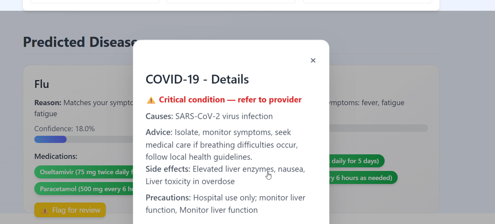

LifeGuard.ai

AI-Powered Symptom Analysis and Healthcare Assistance Platform

LifeGuard.ai is an intelligent health assistant that allows users to enter their symptoms and receive instant AI-driven insights, including probable diseases, recommended medications, critical alerts, and follow-up questions. The system leverages NLP, machine learning, and real-time frontend interactions to deliver a responsive and interactive healthcare tool.

🚀 Features
User-Facing Features

Symptom Input: Enter initial symptoms through a user-friendly interface.

Predicted Diseases: AI-powered predictions with confidence scores for top probable conditions.

Reason for Prediction: Highlights the user’s symptoms that match each predicted disease.

Medications & Dosage Guidance: Personalized dosage suggestions based on age, weight, and allergies.

Critical Alerts: Flags high-risk conditions with clear instructions to consult a healthcare provider.

Follow-Up Questions: Dynamically generated questions to improve prediction accuracy.

Recalibration: Updates predictions based on follow-up answers.

Flag for Human Review: Users can flag uncertain predictions for review by experts.

Visual Summary: Graphical representation of predicted diseases and probabilities.

Technical Highlights
Backend

Built with Python (FastAPI) for fast and scalable API endpoints.

Machine Learning Model:

Trained on structured healthcare datasets to classify diseases based on symptoms.

Utilizes feature extraction from symptom text and additional metadata.

Model saved with Joblib for fast inference.

Natural Language Processing (NLP):

Processes raw symptom text using tokenization and text normalization.

Maps user inputs to known symptoms using a robust NLP pipeline.

Extracts intent and context for follow-up question generation.

Follow-Up Question Engine:

Dynamically generates questions to refine predictions.

Improves model confidence and personalization.

Frontend

Built with React and TailwindCSS for a modern, responsive interface.

Interactive cards display disease details, medications, and precautions.

Real-Time UI Updates for symptom analysis, follow-ups, and recalibration.

Stores flagged predictions locally for potential human review without backend modifications.

Data Privacy & Security

No sensitive user data is stored externally.

All personal details and symptom data are processed locally or via secure API endpoints.

Designed with compliance considerations for healthcare applications.

## Screenshots

### 🔹 Homepage

### 🔹 Symptom Input & Predictions

### 🔹 Disease Details

### 🔹 Follow up Questions

Installation
Backend

# Create virtual environment

python -m venv venv
source venv/bin/activate # Windows: venv\Scripts\activate

# Install dependencies

pip install -r requirements.txt

# Run the API

uvicorn app.main:app --reload

Frontend
cd frontend/lifeguard-frontend
npm install
npm start

Usage

Open the frontend app in your browser.

Enter your symptoms in natural language.

View predicted diseases with confidence scores.

Check medications, dosage, side effects, and precautions.

Answer follow-up questions to recalibrate predictions.

Flag any uncertain predictions for human review.

Model Training

The model is trained on structured healthcare data including diseases, symptoms, medications, and follow-ups.

Feature engineering includes:

Symptom occurrence vectorization

Mutual information scoring for feature importance

Classification algorithms used:

Random Forest for single-sensor predictions

Ensemble models for multi-symptom prediction scenarios

Model evaluation metrics ensure high accuracy and reliability for critical conditions.

Technologies Used

Backend: Python, FastAPI, Scikit-learn, Joblib, NLP (spaCy/NLTK)

Frontend: React, TailwindCSS, React Hooks

Other Tools: Axios (API calls), LocalStorage (flags), Matplotlib/Chart.js for visualization

Future Enhancements

Integration with real-time wearable data for live health monitoring.

Cloud deployment for multi-user access and persistence.

Advanced AI explainability features to provide transparent predictions.

Integration of human-reviewed flagged predictions into the training loop.
